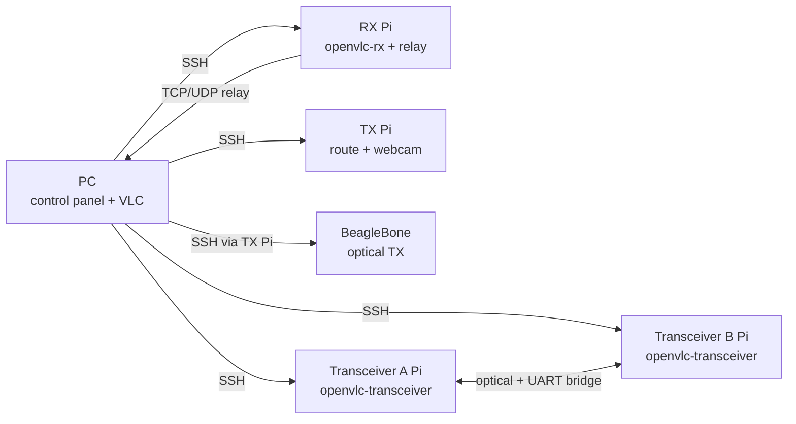

# OpenVLC Control Panel

PySide6 desktop app that runs on the lab PC and controls OpenVLC lab nodes over
SSH. It supports both the legacy RX Pi / TX Pi / BeagleBone video chain and the
two-node STM32 Pi HAT transceiver setup (`openvlc-transceiver` on node A/B).



## Install on Windows

```powershell
winget install Python.Python.3.12
cd communications\openvlc\control-app
py -m venv .venv
.\.venv\Scripts\Activate.ps1
pip install -r requirements.txt
py run.py
```

Install VLC on the PC and keep the path configured in the Settings tab.

## First run

1. Open **Settings**.
2. Fill in the SSH settings for the nodes you use. For the Pi HAT transceiver
   workflow, configure **Transceiver A Pi** and **Transceiver B Pi**. For the
   legacy video workflow, configure **RX Pi**, **TX Pi**, and **BeagleBone TX**.
   The BBB can use the TX Pi as jump host when it is reachable only through USB
   gadget Ethernet.
3. Set **This PC IP**, **VLC path**, and the validated **TX budget profile**.
4. Save, then run **Test connections**.
5. Run **Check system** before starting traffic.

The configuration is stored in `~/.openvlc_panel.json`. It is plain JSON for lab
convenience, not secure credential storage.

The **RX bridge** and **TX route** buttons run privileged commands on the
Raspberry Pis. Either save the SSH password for those devices in Settings or
configure passwordless sudo for the lab user. Without one of those, systemd and
route setup commands fail with `sudo: a terminal is required`.

For the BBB, prefer a numeric host address. The usual direct USB-gadget target
is `192.168.7.2`; if the BBB is reachable only from the TX Pi, set
`192.168.7.2` as the BBB host and configure the TX Pi fields as its jump host.

## Tabs

### Control

The first tab separates the workflow into three explicit stages:

1. **Verify** - run read-only checks for devices, paths, routes and tools.
2. **Prepare link** - start monitoring, restart the RX bridge, configure the
   TX route and start the selected BBB optical profile.
3. **Performance test** - choose UDP target rate, duration and direction, then
   run iperf.

For the Pi HAT transceiver workflow, the app provides service controls for
node A, node B, and A+B together. The `openvlc-transceiver` daemon is
bidirectional by design, so the app separates TX and RX at test level:

- **Transceiver A -> B** starts iperf server on B and client on A.
- **Transceiver B -> A** starts iperf server on A and client on B.
- **Transceiver full duplex** starts servers on both nodes and clients in both
  directions concurrently.

The **Journal TRX A/B** buttons switch the live monitor to
`journalctl -u openvlc-transceiver -f -o cat -n 0` on the selected node.

Video controls are intentionally absent from this tab. The complete live
session is started and stopped from the **Video** tab.

The iperf result shown by the panel is based on the receiver/server output for
each flow, because that is the authoritative result for delivered throughput
and loss. The transmitter/client output is still included for context.

The iperf runner starts remote processes through PID files:

- receiver/server: `/tmp/openvlc_panel_iperf_server.pid` and
  `/tmp/openvlc_panel_iperf_server.log`;
- transmitter/client: `/tmp/openvlc_panel_iperf_client.pid` and
  `/tmp/openvlc_panel_iperf_client.log`.

Use **Stop iperf** to terminate any server/client started by the panel. The app
then collects the receiver and transmitter logs and prints them in the Activity
log.

When iperf starts, the GUI also starts the monitor if needed and records link
quality samples for the test interval. It does not start or restart the RX
bridge, TX route, or BBB optical TX; those belong to Prepare link. The final iperf
output includes:

- RX goodput.
- RX loss.
- quality verdict.
- score average/min/max.
- jitter average/max.
- timing quality average.
- Reed-Solomon correction average/max.
- SFD lock and SFD error summary.

### Link Quality

- **Start monitor** tails the selected link service:
  `openvlc-rx` for the legacy RX Pi or `openvlc-transceiver` for transceiver
  A/B. The monitor shows the latest 80 journal lines immediately and then
  follows new output. Raw journal text appears in both the Control Activity log
  and the Link Quality live journal console.
- **Check system** runs a preflight across RX Pi, TX Pi, BBB, local VLC path,
  routes, camera presence, services, and tool availability.
- **Collect diagnostics** writes a local report in `~/Downloads`.
- The link badge checks stale logs, bridge errors, host/ring drops, zero valid
  packets while traffic is present, SFD errors, and excessive timing jitter.

Readouts include IP rate, frame rate, transceiver TX/RX kbps/fps, last iperf
goodput, `ok/s`, `seen/s`, `ok/seen` diagnostic ratio, per-interval
`seq_gap`, transceiver RX gap, TX drop, ring/host drops, host errors, invalid
IP packets, serial CRC/header errors, edge rate, glitch rate/permille,
comparator threshold, half-cell estimate, decode time, compact firmware
CRC/sync/frame-fail counters, quality score, score minimum, jitter, timing
quality (`tq`), Reed-Solomon corrections, SFD lock/sync/pre-reject counters,
payload length, raw frame length, and PHY status.

Raw comparator metrics can be non-zero even when the opposite optical TX is
off. Ambient light, analog front-end noise, threshold servo activity, and
periodic firmware reporting can still produce `COMP` log lines. The link badge
therefore does not treat raw `edge/s`, duty, or threshold updates as a valid
link. It reports **idle (no valid RX packets)** unless recent receiver-side
valid packets, bridge RX rate, or packet logs are present. During an iperf run,
the same condition is reported as degraded.

The **Live metrics** summary uses `IP rate` for the live bridge throughput. The
separate `iperf RX goodput` field is only populated after an iperf run.
Goodput means the receiver-measured useful UDP/application payload rate for
that test. It is the throughput that applications can actually consume, after
PHY overhead, preamble/SFD/header bytes, Reed-Solomon parity, inter-frame gaps,
and rejected packets. It is not the BBB enqueue rate and it is not the raw
Manchester symbol rate.

The quality score is the packet-level metric emitted by the STM32 receiver. In
host-forward mode the firmware suppresses per-packet `VLC_RX packet` text to
save UART bandwidth, so the latest valid packet quality is carried on the
periodic `COMP` line as `qvalid=1 score=... jitter=... tq=... rs=...`. Older
or non-forwarding firmware may log the same values as `lqi` and `tjit`; the GUI
normalizes them to `score` and `jitter`. This metric is not electrical SNR. It
summarizes decoder margin from the edge-timing architecture: stable timing,
valid SFD lock, valid Manchester reconstruction, low jitter, and packet
validation behavior. It is the metric to watch when changing AGC, comparator
threshold, TX budget, optics, or distance. It is available only after at least
one packet is accepted in the current reporting interval (`qvalid=1` in the
STM32 log).

The `seq_gap / ringdrop` chart shows new events per log interval, not lifetime
counter totals. When the monitor goes stale, transient readouts are cleared and
the interval-rate plots are driven back to zero so old drops are not shown as
current link failures.

`ok/seen` is intentionally not used as a degraded-link gate. `seen/s` includes
candidate bursts and false starts submitted to the PHY, while `ok/s` is the
validated IP packet rate. A low `ok/seen` ratio can be normal when `ok/s`,
goodput, score, jitter, `seq_gap`, and `ringdrop` are healthy.

### Diagnostics

Dedicated tab for preflight, SSH connection test, and report collection. Output
is mirrored from the Control tab so command results are easy to copy.

For transceiver nodes the report includes `openvlc-transceiver` service state,
recent STM32 journal, `/etc/default/openvlc-transceiver`, `tun0`, route to the
peer TUN IP, serial devices, and running bridge/iperf processes.

### Video

**Start video session** performs the complete operation in order: it starts the
RX relay/player and, after the relay is ready, starts the selected TX camera
profile. **Stop video session** stops both sides. There is no separate,
duplicated live-start step.

The **Camera location** selector controls the complete video route:

- **Camera on Node B → receive on Node A** uses the `Transceiver B Pi` SSH
  endpoint, sends to the configured Transceiver A TUN IP (normally
  `192.168.0.1`), and starts the relay on `Transceiver A Pi`. This is the
  default.
- **Camera on Node A → receive on Node B** uses the `Transceiver A Pi`, sends
  to the Transceiver B TUN IP (normally `192.168.0.2`), and starts the relay on
  `Transceiver B Pi`.
- **Legacy TX Pi → RX Pi** preserves the BeagleBone/one-way setup.

The selection is saved in `~/.openvlc_panel.json` as `video_camera_node`.
Changing it does not require editing Python or duplicating transceiver
credentials into the legacy TX/RX fields. The selector is locked while a video
session is active so stop, status checks and cleanup always target the same
machines that were used at session start.

The session badge now represents the video pipeline, not only the optical-link
badge:

- `STARTING`: creating the RX relay and local player;
- `BUFFERING`: relay and encoder are alive, VLC has not decoded video yet;
- `LIVE`: embedded VLC reached `Playing`;
- `TX ERROR` / `RELAY ERROR`: the corresponding remote process exited;
- `NO VIDEO`: both remote processes are alive but the player did not decode a
  stream within the startup window.

The text below the preview reports the player state. On an error, the Control
log includes the tails of `/tmp/openvlc_panel_relay.log` and
`/tmp/openvlc_panel_tx_video.log`. The main link-health badge can remain healthy
when video fails because it validates the optical/packet path, not FFmpeg,
UDP/5000, the relay, or VLC decoding.

The configured video port is passed explicitly to both ends of the session.
FFmpeg transmits to the TUN address automatically derived from **Camera
location**, and the relay on the opposite node listens on the same
`<video_port>`. This is required when using a non-default value; previously the
destination was hardcoded to `192.168.0.2` and the relay followed only the
legacy RX Pi setting.

The live viewer can use:

- **TCP relay** for cleaner PC playback and fewer firewall issues.
- **UDP relay** for lower latency.
- Embedded VLC via `python-vlc`, or an external VLC window as fallback.

TX video uses named profiles first. Advanced encoding fields are collapsed by
default and can be expanded when needed:
capture/output size, fps, bitrate, MPEG-TS muxrate, rate mode, CRF, x264 preset,
VBV buffer, mux delay, and V4L2 input format.

After an iperf run, the video panel compares the selected `MUXRATE` with the
measured RX goodput and displays the capacity margin. Keep a practical margin
of at least 10-15 percent for stable video.

### Settings

Settings are split between:

- Device SSH endpoints.
- Local PC settings and validated TX budget profile.
- Advanced remote directories, transceiver TUN IPs, iperf payload size and
  ports.

Only validated TX budget profiles are selectable. This avoids the old failure
mode where the UI accepted values that had no matching BBB script/RX profile.

## Remote process management

Processes started by the panel use PID files instead of broad `pkill` commands:

| Process | PID file | Log |
| --- | --- | --- |
| RX live relay | `/tmp/openvlc_panel_relay.pid` | `/tmp/openvlc_panel_relay.log` |
| TX video | `/tmp/openvlc_panel_tx_video.pid` | `/tmp/openvlc_panel_tx_video.log` |
| iperf receiver/server | `/tmp/openvlc_panel_iperf_server.pid` | `/tmp/openvlc_panel_iperf_server.log` |
| iperf transmitter/client | `/tmp/openvlc_panel_iperf_client.pid` | `/tmp/openvlc_panel_iperf_client.log` |

The GUI only stops processes it started. If a manual `ffmpeg`, `socat`, or
iperf instance is already running, the preflight/diagnostics output makes that
visible so it can be handled intentionally.

## Diagnostics

**Collect diagnostics** creates:

```text
~/Downloads/openvlc_diag_YYYYMMDD_HHMMSS.txt
```

The report includes sanitized local configuration, recent RX bridge journal,
network interfaces/routes, TX camera formats, current media processes, BBB TX
profile, BBB `VLC: params`, `vlc0` counters, and qdisc state.

Attach this file when debugging GUI, routing, link, or video issues.
