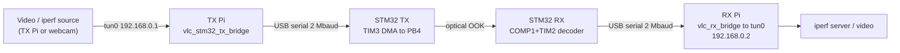
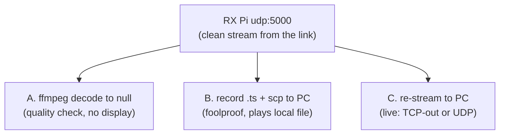

# OpenVLC Operations, Testing, and Parameter Reference

End-to-end runbook for bringing up, validating, and streaming video over the
OpenVLC optical link, plus a reference for every configurable parameter. For
the architecture and per-device detail see the repository
[`README.md`](../../README.md) and the device folders.

**Contents**
1. [Topology & device roles](#1-topology--device-roles)
2. [What to copy where](#2-what-to-copy-where)
3. [Bring-up & validation runbook](#3-bring-up--validation-runbook)
4. [Video streaming](#4-video-streaming)
5. [Watching the video headless](#5-watching-the-video-headless)
6. [Latency tuning](#6-latency-tuning)
7. [Parameter reference](#7-parameter-reference)
8. [Profile matching (TX budget vs RX rate)](#8-profile-matching-tx-budget-vs-rx-rate)
9. [Troubleshooting](#9-troubleshooting)

---

## 1. Topology & device roles



| Device | Hostname (example) | Job |
| --- | --- | --- |
| STM32 TX | n/a | **Transmits** optically. Receives host-framed IP packets from the TX Pi over USART3. |
| STM32H743 Nucleo | n/a | **Receives** optically, forwards decoded IP over USB serial. Flashed from CubeIDE. |
| TX Raspberry Pi | `VLCTX` | Runs the TUN-to-STM32 TX bridge; generates iperf/video toward `192.168.0.2`. |
| RX Raspberry Pi | `VLCRX` | Runs the **serial to tun0 bridge**; hosts the iperf server / records video. |

Addresses used by the final scripts: TX Pi `tun0` `192.168.0.1/24`, RX Pi
`tun0` `192.168.0.2/24`. Legacy BBB transmitter notes remain in this document
for comparison, but the final STM32-TX path does not route through the BBB.

---

## 2. What to copy where

Source of truth is this repo on your workstation. Each device needs only its
own folder.

**STM32 TX Raspberry Pi** - needs `raspberry-gateway/`:
```bash
scp -r .../openvlc/raspberry-gateway vlctx@<PI_TX>:~/
```

**Legacy BeagleBone TX** - optional reference only. It needs `beaglebone-tx/`
(the PRU compiler `clpru` lives only on the BBB, so the TX is **built on the
BBB**, never on the Pi):
```bash
# workstation -> TX Pi -> BBB (BBB usually reachable only via the Pi/USB):
scp -r .../openvlc/beaglebone-tx vlctx@<PI_TX>:~/
# from the TX Pi to the BBB (old Debian 8 SSH needs legacy scp or tar):
scp -O -r ~/beaglebone-tx debian@192.168.7.2:/home/debian/
#   if scp still fails (old<->new OpenSSH), use tar over ssh:
tar czf - -C ~ beaglebone-tx | ssh debian@192.168.7.2 'tar xzf - -C /home/debian'
```

**RX Raspberry Pi** - needs `raspberry-gateway/`:
```bash
scp -r .../openvlc/raspberry-gateway vlcrx@<PI_RX>:~/
```

**TX Raspberry Pi** - needs `raspberry-gateway/` (for
`install/install_tx_stm32_service.sh`, `tools/vlc_link_test.sh`, `tools/vlc_tx_video.sh`).

**STM32 (RX)** - no copy; build and flash from STM32CubeIDE on the workstation.

---

## 3. Bring-up & validation runbook

### 3.1 STM32 receiver
1. In `stm32-rx/Core/Inc/openvlc_board.h` confirm the profile matches the TX
   budget you will run (see [section 8](#8-profile-matching-tx-budget-vs-rx-rate)) and
   that diagnostics are off (`OPENVLC_BURST_TRACE 0`,
   `OPENVLC_COMP_THRESHOLD_SWEEP 0`).
2. Build (**Release / -O2**) and flash from CubeIDE.
3. Boot log should show `... rate=1000k` (or `1250k`) followed by
   `BOOT: COMP1/DAC1/TIM2-IC started`, with no HardFault.

### 3.2 STM32 transmitter bridge (run on the TX Pi)
```bash
cd ~/raspberry-gateway
sudo bash ./install/install_tx_stm32_service.sh
sudo systemctl status openvlc-tx-stm32
ip route get 192.168.0.2
```

The route must report `dev tun0 src 192.168.0.1`. The STM32 bridge installs a
peer `/32` route deliberately, replacing any more-specific route through
`eth0` left by the former BBB setup.

Foreground debug:
```bash
cd ~/raspberry-gateway
sudo bash ./install/setup_stm32_tx_pi.sh
```

### 3.2b Legacy BeagleBone transmitter (run **on the BBB**, optional)
```bash
cd ~/beaglebone-tx
# budget 50 (validated) via the router that also sets up eth0->vlc0 forwarding:
OPENVLC_TX_ENABLE_MODE=0 PI_IF=eth0 \
  OPENVLC_TX_SYMBOL_WAIT_BUDGET=50 bash ./install/setup_bbb_tx_router.sh
```
Validate: `ip -s link show vlc0` (UP, TX counters rising),
`dmesg | grep 'VLC: params' | tail -1`.

### 3.3 TX Pi traffic source
Use the same TX Pi that is running `openvlc-tx-stm32`. Traffic to
`192.168.0.2` should route to `tun0`.

### 3.4 RX Pi (serial bridge)
```bash
cd ~/raspberry-gateway
sudo bash ./install/install_rx_service.sh
grep OPENVLC_SERIAL_BAUD /etc/default/openvlc-rx     # must equal firmware (2000000)
sudo systemctl restart openvlc-rx
```

### 3.5 End-to-end link test (iperf2 UDP)
```bash
# RX Pi (server):
ROLE=rx bash /opt/openvlc-raspberry/vlc_link_test.sh
# TX Pi (client), budget-40 initial validation:
RATE=800k DURATION=60 bash /opt/openvlc-raspberry/vlc_link_test.sh
```
The **server (RX) report is authoritative**. Watch the PHY at the same time on
the RX Pi:
```bash
journalctl -u openvlc-rx -f | grep --line-buffered -E "COMP |RXRATE|\[bridge\]"
```
Healthy: `ok` near the offered frame rate, `hostdrop=0`, `ringdrop` not
climbing, `[bridge] rate` rising. The validated budget-50 operating point is
roughly 0.8-1.0 Mbit/s of delivered UDP/IP under clean conditions.

`iperf -b` counts UDP payload bits. The bridge rate counts complete IPv4
packets, including the 20-byte IPv4 and 8-byte UDP headers. With the default
752-byte payload, an offered `800k` therefore appears near `830 kbit/s` in the
bridge log; `400k` appears near `415 kbit/s`. This is accounting overhead, not
a PHY-rate limit.

### 3.6 Desktop control panel

The host PC can run the PySide6 control panel in
[`control-app/`](../../control-app/) instead of typing the bring-up commands by
hand.

Recommended GUI order:

1. **Settings -> Save -> Test connections**.
2. **Check system** to verify SSH, routes, tools, camera, service state, and BBB
   TX profile.
3. **Start monitor** to stream `openvlc-rx` logs into the Link Quality tab.
4. **RX bridge** to restart the serial bridge.
5. **TX route** to configure the TX Pi route through the BBB.
6. **BBB TX** to start one of the validated TX budget profiles.
7. **iperf** to measure delivered RX goodput. The panel reports the RX server
   result as authoritative.
8. **Video** to start a selected webcam profile and check its muxrate margin
   against the measured goodput.

The GUI's **Link Quality** tab parses `COMP`, `RXRATE`, `PHY`, `SFDSYNC`, and
optional `VLC_RX packet` lines. In host-forward mode the STM32 suppresses
per-packet text logs, so the periodic `COMP` line also carries the latest
quality sample for intervals that delivered at least one packet:
`qvalid=1 score=... jitter=... tq=... rs=...`. During iperf the GUI records
the receiver's packet-level quality score (`lqi`/`score`), timing jitter
(`tjit`/`jitter`), Reed-Solomon corrections, SFD lock/error state, and PHY
status alongside the RX goodput/loss report. This score is a decoder-margin
metric for the comparator/edge-timing receiver; it is more actionable for this
architecture than electrical SNR.

The GUI displays `seq_gap`, `ringdrop`, `hostdrop`, and `hosterr` as
per-interval events. The raw log fields remain cumulative counters, but a flat
counter means a healthy interval and should appear as zero in the chart.

The GUI intentionally exposes only validated BBB TX budget profiles. If a new
budget is added later, add the matching BBB setup script and STM32 RX timing
profile before exposing it in the panel.

Use **Collect diagnostics** before changing parameters when something looks
wrong. It captures RX journal output, interface state, camera formats, BBB TX
profile, `vlc0` counters, qdisc state, and local GUI configuration into a single
report under `~/Downloads`.

---

## 4. Video streaming

H.264 in MPEG-TS over UDP to `192.168.0.2:5000`.

```bash
# TX Pi, stable baseline:
BITRATE=500k MUXRATE=650k bash vlc_tx_video.sh

# TX Pi, higher-quality profile after iperf validates enough margin:
bash ./tools/vlc_tx_video_quality.sh
```

Keep `MUXRATE` (the wire load) below measured link capacity. FFmpeg performs
constant-rate MPEG-TS pacing; do not leave a manual BBB `tc tbf` rate limiter
active unless you are deliberately running a queueing experiment. See
[section 7](#7-parameter-reference) for all knobs and
[cbr vs capped-crf](#rate-control-cbr-vs-capped-crf).

---

## 5. Watching the video headless

You are usually on the RX Pi over SSH, with no display. The video lands on
`udp://0.0.0.0:5000` on the RX Pi. Three ways out:



**A - quality check (no display):**
```bash
ffmpeg -hide_banner -fflags +discardcorrupt \
  -i "udp://0.0.0.0:5000?fifo_size=65536&overrun_nonfatal=1" \
  -t 20 -f null - 2>&1 | grep -iE "corrupt|concealing|frame=" | tail
```
`frame=` rising with few/zero `corrupt`/`concealing` = the link delivers clean
video.

**B - record and view on your PC (no firewall/routing involved):**
```bash
# RX Pi (only ONE reader of port 5000 at a time):
ffmpeg -hide_banner -i "udp://0.0.0.0:5000?fifo_size=65536&overrun_nonfatal=1" \
  -c copy -t 15 ~/rx_capture.ts
```
```powershell
# PC:
scp vlcrx@<PI_RX>:~/rx_capture.ts .
# play the LOCAL file (no network -> firewall cannot block it):
& "C:\Program Files\VideoLAN\VLC\vlc.exe" rx_capture.ts
```

**C - live view on your PC.** Two transports, pick by need:

> ### Live-view golden rules (learned the hard way)
> 1. **Play with `--avcodec-hw=none`.** VLC's hardware H.264 decoder glitches on
>    *live* streams (blocks / frozen bands) while the same content plays clean
>    as a file. Software decode fixes it. In that failure mode the optical link
>    can be clean (`seq_gap=0`) while playback still looks corrupted.
> 2. **Exactly one reader of UDP 5000.** Leftover `ffmpeg`/`socat` processes
>    steal packets and cause blocks. Before every attempt:
>    `sudo pkill -9 ffmpeg socat ; sudo ss -lunp | grep ':5000'` (must be empty).
> 3. **Don't over-tune for latency.** `-fflags nobuffer`, `-flags low_delay`,
>    `--drop-late-frames` and tiny `fifo_size` *cause* the gray bands (they
>    truncate frames). Keep generous buffers; control latency only with the
>    player's `--network-caching`.

The relay carries the (clean) stream from the RX Pi to your PC. A raw `socat`
byte-relay is simplest; `ffmpeg -c copy` also works.

- **TCP relay (PC connects out; no inbound firewall rule needed):**
  ```bash
  # RX Pi (single reader):
  sudo pkill -9 ffmpeg socat
  socat -u UDP-RECV:5000 TCP-LISTEN:5001,reuseaddr
  ```
  ```powershell
  # PC (software decode, generous cache = clean):
  & "C:\Program Files\VideoLAN\VLC\vlc.exe" --avcodec-hw=none --network-caching=1000 "tcp://<PI_RX>:5001"
  ```
- **UDP relay (lower latency; needs a one-time firewall allow):**
  ```bash
  # RX Pi:
  sudo pkill -9 ffmpeg socat
  socat -u UDP-RECV:5000 UDP-SENDTO:<PC_IP>:5001
  ```
  ```powershell
  # PC (admin, once): allow inbound UDP 5001
  New-NetFirewallRule -DisplayName "udp-5001-in" -Direction Inbound -Protocol UDP -LocalPort 5001 -Action Allow -Profile Any
  # then (software decode, low cache for latency):
  & "C:\Program Files\VideoLAN\VLC\vlc.exe" --avcodec-hw=none --network-caching=300 "udp://@:5001"
  ```

> **VLC vs ffplay on Windows:** if `ffplay` shows a black window while VLC works,
> Windows Firewall has a per-application **block** rule for `ffplay.exe`
> (created from a dismissed first-run prompt). Block rules override port
> allows. Either use VLC, or remove the block as admin:
> `Get-NetFirewallApplicationFilter -Program *ffplay.exe* | Get-NetFirewallRule | ? Action -eq Block | Remove-NetFirewallRule`.
>
> **Isolating "blocks in live but the recording is clean":** capture the live
> on the PC to a file and play *that* (`ffmpeg -i "tcp://<PI_RX>:5001" -c copy
> -t 12 "$HOME\Downloads\pc_capture.ts"`). Clean file means it is the player
> (use `--avcodec-hw=none`). Corrupt file on a TCP relay means a second reader is
> stealing packets from UDP 5000.

---

## 6. Latency tuning

Latency is the sum of every buffer in the chain. On a lossy link there is a
hard trade-off: **less buffering = lower latency but more visible artifacts.**

| Lever | Where | Effect |
| --- | --- | --- |
| `MUXDELAY=0` (default 0.6) | `tools/vlc_tx_video.sh` | biggest single cut (~0.6 s) |
| `BUFSIZE` smaller | `tools/vlc_tx_video.sh` | tighter encoder VBV, less queueing |
| `--network-caching=200` | VLC on PC | from 1000 ms default |
| `--drop-late-frames` / `-framedrop` | player | drop late frames to keep realtime |
| `latency 25ms` | BBB `tc tbf` | shorter standing queue |
| UDP last hop | re-stream | drops instead of hoarding (TCP never drops) |

**Constant ~10 s of delay** that never recovers = a standing buffer that never
drains, classic with **TCP on a lossy link** (it retransmits instead of
dropping). Fix with `-framedrop`/`--drop-late-frames` and a clean restart, or
switch the last hop to UDP.

**Heavy macroblocking after going low-latency** = buffers cut too small for the
WiFi jitter on the Pi to PC hop (it is the WiFi hop, not the optical link; the
recorded file proves the link is clean). Raise the re-stream `fifo_size`, set
`pkt_size=1316`, and use a ~200 ms player cache.

Floor: encode + decode (one frame each) + link serialization + the re-stream
hop is realistically about **150-300 ms**; below that needs a display on the RX node
itself (no re-stream hop) or higher fps.

---

## 7. Parameter reference

### `tools/vlc_tx_video.sh` (TX video encoder)
| Variable | Default | Meaning |
| --- | --- | --- |
| `DEV` | `/dev/video0` | webcam device |
| `DEST` | `192.168.0.2` | RX tun0 IP (destination of the UDP stream) |
| `PORT` | `5000` | UDP port |
| `SIZE` | `640x360` | native Logitech C270 MJPEG capture mode |
| `FPS` | `15` | capture frame rate |
| `OUT_SIZE` | (= `SIZE`) | re-scaled output resolution (e.g. `854x480`) |
| `OUT_FPS` | (= `FPS`) | output frame rate |
| `CODEC` | `x264` | `x264` (H.264, better compression) or `mjpeg` (simpler) |
| `RATE_MODE` | `cbr` | `cbr` (constant rate) or `capped-crf` (constant quality, capped) |
| `BITRATE` | `500k` | H.264 elementary-stream rate; in capped-crf it is the **maxrate cap** |
| `MUXRATE` | `650k` | paced MPEG-TS rate on the wire (**keep below link capacity**) |
| `CRF` | `21` | capped-crf quality target (lower = sharper, more bits) |
| `BUFSIZE` | `150k` | VBV buffer; smaller = lower latency, less bursty |
| `PRESET` | `veryfast` | x264 speed/efficiency; slower = better quality per bit |
| `H264_PROFILE` | `main` | CABAC efficiency; B-frames remain disabled |
| `H264_LEVEL` | `3.0` | H.264 level |
| `GOP` | `=fps` | keyframe interval (1 IDR/sec); shorter = faster recovery |
| `MUXDELAY` | `0.60` | TS mux delay (seconds). Lower it for latency only after checking PCR/DTS warnings. |
| `PKT` | `752` | UDP payload = 4 * 188 TS packets (IP total 780 B); multiple of 188 |
| `SLICE_BYTES` | `600` | max H.264 slice size (smaller slice = a lost packet damages less) |
| `BURST_PACKETS` | `1` | TS burst grouping |
| `SEND_BUFFER` | `262144` | UDP socket send buffer |
| `INPUT_FORMAT` | `mjpeg` | compressed USB capture; recommended for the C270 |
| `THREAD_QUEUE_SIZE` | `256` | bounded V4L2 input queue |
| `CAMERA_TUNE` | `1` | apply stable-cadence C270 controls when available |
| `POWER_LINE_FREQUENCY` | `1` | anti-flicker mode: 1=50 Hz, 2=60 Hz |
| `EXPOSURE_AUTO_PRIORITY` | `0` | prevent auto exposure from lowering camera fps |
| `LOGLEVEL` | `info` | ffmpeg log level |

### Logitech C270

The validated camera advertises native MJPEG at `640x360`, `640x480`, and
`864x480`, including 15 and 20 fps. Prefer a native mode over capturing
`640x480` and stretching it to 16:9:

- stable: `640x360@15`, 500k video, 650k mux;
- low latency: `640x360@20`, 560k video, 760k mux;
- more detail: `864x480@15`, 680k video, 800k mux.

The launcher disables `exposure_auto_priority` when the control exists. This
keeps the requested frame cadence in low light. It does not affect optical PHY
jitter; it prevents camera-side frame timing variation and video stalls.

Verify the active camera mode while the encoder is stopped:

```bash
v4l2-ctl -d /dev/video0 --get-fmt-video
v4l2-ctl -d /dev/video0 --get-parm
v4l2-ctl -d /dev/video0 \
  --get-ctrl=exposure_auto_priority,power_line_frequency
```

During streaming, FFmpeg must remain near `speed=1.0x`. A lower value indicates
encoder starvation; it is independent of the optical timing metric.

#### Rate control: cbr vs capped-crf
- **cbr** - constant bits/s regardless of scene. Predictable link load, steady
  LED/AGC, no bursts that overflow a marginal channel; but wastes bits on
  static scenes and degrades on motion. **Safest on this link.**
- **capped-crf** - constant perceptual quality, bitrate floats up to `BITRATE`.
  Best quality-per-bit and low load on static scenes; bursts on motion can fill
  queues and cause artifacts/latency on a channel near capacity. Use for mostly
  static content with a small `BUFSIZE`.

### `tools/vlc_link_test.sh` (iperf2)
| Variable | Default | Meaning |
| --- | --- | --- |
| `ROLE` | `tx` | `tx` = client, `rx` = server |
| `DEST` | `192.168.0.2` | server IP (client mode) |
| `RATE` | `100k` | offered UDP rate |
| `DURATION` | `30` | duration |
| `PAYLOAD` | `752` | UDP payload bytes |
| `PORT` | `10001` | iperf port |
| `INTERVAL` | `1` | report interval (s) |

### `install/setup_tx_pi.sh` (TX Pi routing)
| Variable | Default | Meaning |
| --- | --- | --- |
| `BBB_IF` | `eth0` | Pi interface toward the BBB |
| `TX_PI_CIDR` | `10.0.0.2/24` | Pi address on the BBB link |
| `BBB_IP` | `10.0.0.1` | BBB gateway address |
| `VLC_SUBNET` | `192.168.0.0/24` | optical subnet routed via the BBB |
| `VLC_DEST` | `192.168.0.2` | RX host route (wins over DHCP/VPN) |
| `VLC_MTU` | `900` | path MTU |
| `TX_QUEUE_LEN` | `64` | egress queue / fq_codel limit |

### `install/setup_bbb_tx_router.sh` (BBB TX router; run on the BBB)
| Variable | Default | Meaning |
| --- | --- | --- |
| `PI_IF` | `eth0` | BBB interface receiving from the Pi |
| `BBB_ETH_CIDR` | `10.0.0.1/24` | BBB address on the Ethernet link |
| `VLC_MTU` | `900` | vlc0 MTU |
| `VLC_QDISC_LIMIT` | `24` | vlc0 FIFO limit |
| `OPENVLC_TX_SYMBOL_WAIT_BUDGET` | `50` | optical cell budget (matches RX rate) |
| `OPENVLC_TX_ENABLE_MODE` | `0` | Legacy BBB P8_46 auxiliary LED branch. Use `0`, which holds it low; it is not the packet enable. |
| `OPENVLC_TX_LINE_CODE` | `1` | 1 = Manchester |
| `OPENVLC_TX_WARMUP_BITS` | `0` | leading warm-up bits |

(The `beaglebone-tx/setup_bbb_tx_router.sh` variant runs the **budget-40**
optimized profile via `TX_setup_budget40.sh`.)

### Bridge service - `/etc/default/openvlc-rx`
| Variable | Default | Meaning |
| --- | --- | --- |
| `OPENVLC_SERIAL_PORT` | `auto` | STM32 VCP (auto-detected, or `/dev/ttyACM0`) |
| `OPENVLC_SERIAL_BAUD` | `2000000` | **must equal** firmware `OPENVLC_HOST_UART_BAUD` |
| `OPENVLC_TUN_DEVICE` | `tun0` | bridged TUN interface |
| `OPENVLC_TUN_CIDR` | `192.168.0.2/24` | RX address |
| `OPENVLC_SOURCE_ROUTE` | `10.0.0.0/24` | return route over tun0 |
| `OPENVLC_STATS_INTERVAL` | `5` | `[bridge]` stats period (s) |

### STM32 RX - key `openvlc_board.h` knobs
| Define | Typical | Meaning |
| --- | --- | --- |
| `OPENVLC_PHY_RATE_KBPS` | `1000` / `1250` | timing profile: 1000 = budget 50, 1250 = budget 40 |
| `OPENVLC_COMP_THRESHOLD_DAC` | `2350` | comparator slice level (DAC counts; V = 3.3 * DAC / 4096) |
| `OPENVLC_SFD_SYNC_PREAMBLE_CELLS` | `12` | preamble cells required before SFD lock |
| `OPENVLC_HOST_UART_BAUD` | `2000000` | host serial baud (match the bridge) |
| `OPENVLC_RX_HOST_FORWARD` | `1` | 1 = framed host forward, 0 = plain console |
| `OPENVLC_ENABLE_ICACHE` / `_DCACHE` | `1` / `1` | caches (DMA ring is non-cacheable via MPU) |
| `OPENVLC_BURST_TRACE` / `_THRESHOLD_SWEEP` | `0` / `0` | diagnostics; keep 0 in normal use |

---

## 8. Profile matching (TX budget vs RX rate)

**TX and RX must use the same optical timing**, or nothing decodes.

| Optical profile | TX (BBB) | RX (`OPENVLC_PHY_RATE_KBPS`) | Status |
| --- | --- | --- | --- |
| budget 50 (~0.5 us cell) | `TX_setup_budget50.sh` | `1000u` | **validated; measure on RX, roughly 0.8-1.0 Mbit/s on clean hardware** |
| budget 40 (~0.4 us cell) | `TX_setup_budget40.sh` | `1250u` | experimental, higher capacity |

Change one side, change the other. The validated fallback pair is budget 50 /
`1000u`. The STM32 working tree may be left on `1250u` after budget-40
experiments; the boot log is the authority for what is actually flashed.

---

## 9. Troubleshooting

| Symptom | Cause | Fix |
| --- | --- | --- |
| `clpru: No such file` building TX | running on the Pi, not the BBB | build the TX **on the BBB** (PRU compiler is BBB-only) |
| `scp ... path canonicalization failed` | new OpenSSH scp vs old BBB | `scp -O` + explicit `/home/debian/`, or `tar \| ssh` |
| GUI says `BBB TX ssh=FAIL getaddrinfo failed` | BBB host name is not resolvable from the PC or jump host | use numeric BBB host `192.168.7.2`; if needed set the TX Pi as jump host |
| GUI command fails with `sudo: a terminal is required` | the Pi user needs sudo but the GUI has no password to feed it | save the device SSH password in Settings or configure passwordless sudo for the lab user |
| LED stays off during a test | vlc0 TX not rising, driver/forwarding/route issue, or enable pin | check `ip -s link show vlc0`; verify `setup_*` ran on the right host; try `OPENVLC_TX_ENABLE_MODE=1/2` |
| RX decodes nothing | TX/RX budget mismatch, or wrong threshold | match [section 8](#8-profile-matching-tx-budget-vs-rx-rate); confirm the threshold plateau |
| `ffplay` black, VLC works | firewall blocks `ffplay.exe` inbound | use VLC, or remove the block rule (admin) |
| **blocks / frozen bands in LIVE only (recording is clean)** | **VLC hardware H.264 decode glitches on live streams** | **play with `--avcodec-hw=none`** (software decode) |
| blocks that come and go, "drastically worse" | leftover `ffmpeg`/`socat` still reading UDP 5000 (packet theft) | `sudo pkill -9 ffmpeg socat`; confirm `ss -lunp \| grep ':5000'` is empty |
| `dts < pcr, TS is invalid` on the TX | `MUXDELAY` too small for `BUFSIZE`/`MUXRATE` | set `MUXDELAY >= BUFSIZE/MUXRATE` (default 0.6 is safe) |
| live view ~10 s behind | TCP standing buffer / low-latency hacks removed slack | restart clean; control latency only via player `--network-caching` |
| `ringdrop` climbing in COMP | RX congestion (offered > capacity) | lower offered rate / `MUXRATE`; the 3/4-ring guard prevents collapse but drops |
| video corrupt only at high rate | offered above link capacity | keep `MUXRATE` under measured iperf capacity |
