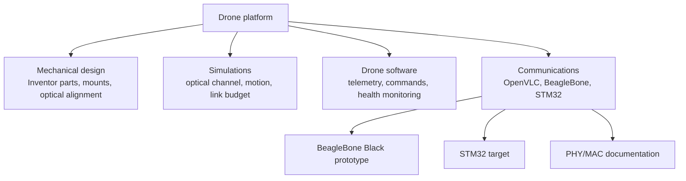

# Sunrise Architecture

Sunrise integrates a visible-light communication link into a drone platform.
The repository is split so mechanical design, simulations, drone software, and communication firmware can evolve independently while still sharing one system-level view.



## Communication Prototype

The current working link combines two implementations:

```text
communications/openvlc/beaglebone_black/  network-facing TX
communications/openvlc/stm32/             embedded RX
```

Its end-to-end architecture is:

```text
Linux application
  -> Linux network stack
  -> BeagleBone OpenVLC kernel driver
  -> PRU1 OOK / Manchester transmitter
  -> LED and visible-light channel
  -> photodiode / AGC frontend
  -> STM32 COMP1 hardware slicing
  -> TIM2 CH4 both-edge input capture
  -> DMA edge timestamp ring
  -> preamble-gated SFD synchronization
  -> Manchester and physical-length recovery
  -> Reed-Solomon validation
  -> STM32 packet callback
```

The platform-specific details are documented in:

- [`../communications/openvlc/beaglebone_black/docs/architecture.md`](../communications/openvlc/beaglebone_black/docs/architecture.md);
- [`../communications/openvlc/stm32/docs/architecture.md`](../communications/openvlc/stm32/docs/architecture.md).

## STM32 Receiver

The STM32 receiver reuses the BBB frame format, raw alternating preamble,
Manchester coding, SFD, physical-length semantics, and Reed-Solomon layout. It
does not copy the Linux/PRU runtime structure.

The active receive path is:

```text
scaled AGC/Vin on PB2
  -> COMP1 with DAC1_CH1 threshold and hysteresis
  -> TIM2 CH4 input capture at 16 MHz
  -> DMA edge timestamps
  -> burst and short-pulse validation
  -> single/double interval timing recovery
  -> alternating-preamble gate
  -> exact or inverse SFD match
  -> Manchester pair recovery
  -> length, bounds, completeness, and alignment checks
  -> Reed-Solomon block validation
  -> packet delivery
```

The active STM32 receiver does not use ADC sampling or a matched filter.
Comparator edge/glitch rates, normalized edge-timing residuals, Manchester
pair errors, timing outliers, Reed-Solomon corrections, and a combined
link-quality indicator are reported as diagnostics; they do not replace final
packet integrity checks.

The complete acceptance sequence and counter semantics are specified in
[`../communications/openvlc/stm32/docs/packet_validation.md`](../communications/openvlc/stm32/docs/packet_validation.md).
