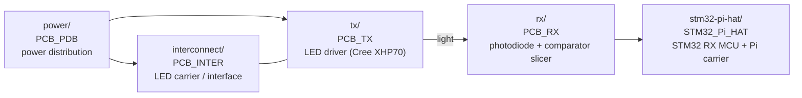

# Hardware (PCBs)

Altium Designer source and fabrication outputs for the custom boards of the
OpenVLC optical link. These are the physical layer the firmware in the sibling
firmware under communications/openvlc/ runs on: the LED transmitter, the photodiode/comparator
receiver front-end, their power and interconnect boards, and the STM32 +
Raspberry Pi carrier.

| Folder | Board family | Role in the link |
| --- | --- | --- |
| [`tx/`](tx/) | `PCB_TX` | Optical **transmitter** — high-power LED (Cree XHP70) driver. Driven by the Pi HAT in [`../firmware-v2/`](../communications/openvlc/firmware-v2/). |
| [`rx/`](rx/) | `PCB_RX` | Optical **receiver** front-end — photodiode + analog comparator slicer feeding the STM32. Feeds the Pi HAT in [`../firmware-v2/`](../communications/openvlc/firmware-v2/). |
| [`interconnect/`](interconnect/) | `PCB_INTER` | Interconnect / LED carrier board between the driver and the optics. |
| [`power/`](power/) | `PCB_PDB` | Power Distribution Board supplying the LED / driver chain. |
| [`stm32-pi-hat/`](stm32-pi-hat/) | `STM32_Pi_HAT` | Carrier HAT for the STM32 receiver MCU and the Raspberry Pi gateway ([`../raspberry-gateway/`](../communications/openvlc/raspberry-gateway/)). |

## Revision history

Newest revision per family is listed last and is the current design. A
**Fab date** means a manufacturer order package (`P-<job>_<date>_…`) is
included, i.e. that revision was actually built; revisions with only a
*Project Outputs* archive are design/output snapshots.

### Transmitter — `tx/`
| Revision | 3D | Fab package | Notes |
| --- | :-: | --- | --- |
| `PCB_TX_V2.1.3_B` | ✓ | output archive | bundles footprint libs (XHP70 LED, 0603 R/C) |
| `PCB_TX_V2.1.3_C` | ✓ | output archive | |
| `PCB_TX_V2.2_A` | ✓ | output archive | **current TX** |

### Receiver — `rx/`
| Revision | 3D | Fab package | Notes |
| --- | :-: | --- | --- |
| `PCB_RX_V2.4` | ✓ | — | with footprint libs |
| `PCB_RX_V2.4_B` | ✓ | — | with footprint libs |
| `PCB_RX_V2.5_A` | ✓ | output archive | |
| `PCB_RX_V2.5_B` | ✓ | output archive | |
| `PCB_RX_V2.5_C` | ✓ | output archive | |
| `PCB_RX_V2.6` | ✓ | **2025-12-13** (P-17464) | manufactured |
| `PCB_RX_V2.7` | ✓ | **2025-12-13** (P-17464) | manufactured — **current RX** |

### Interconnect — `interconnect/`
| Revision | 3D | Fab package | Notes |
| --- | :-: | --- | --- |
| `PCB_INTER_V1.1` | ✓ | — | with footprint libs |
| `PCB_INTER_V1.2` | ✓ | **2025-12-13** (P-17464) | manufactured — **current** |

### Power Distribution — `power/`
| Revision | 3D | Fab package | Notes |
| --- | :-: | --- | --- |
| `PCB_PDB_V1.1` | ✓ | — | with footprint libs |
| `PCB_PDB_V1.2` | — | output archive | **current** |

### STM32 / Raspberry Pi carrier — `stm32-pi-hat/`
| Revision | 3D | Fab package | Notes |
| --- | :-: | --- | --- |
| `STM32_Pi_HAT` | ✓ | **2026-05-29** (P-18729) | manufactured. Schematic file is `SRM32_Pi_HAT.SchDoc` (original typo, kept to preserve the Altium project link). |

## What each revision folder contains

- **Editable source** (open in Altium Designer):
  - `*.PrjPcb` — the project file (open this);
  - `*.SchDoc` — schematic;
  - `*.PcbDoc` — board layout;
  - `*.PcbLib` — local footprint libraries used by that revision (where present).
- **`*.step`** — 3D model of the assembled board (mechanical / enclosure work).
- **Fabrication package** — a `.zip` of Gerbers, NC drill, and drill reports,
  ready to send to a board house. The `P-<job>_<date>_…` archives are the
  exact packages that were ordered.

## What was intentionally excluded

To keep the repository lean, the following Altium working artifacts were **not**
imported (they are regenerated locally by Altium and were ~1.1 GB):

- `History/` — automatic per-save backups;
- per-board nested `.git/` repositories (would have become broken submodules);
- `__Previews/`, `Project Logs for …/`;
- `*.PrjPcbStructure`, `*.SchDocPreview` — regenerated index/preview files;
- the loose `Project Outputs for …/` Gerber folders — already captured by the
  per-revision fabrication `.zip`.

See [`../.gitignore`](../communications/openvlc/.gitignore) for the patterns that keep these out if the
original Altium folders are ever re-synced over this tree.

## Opening a board

1. Install Altium Designer.
2. Open the revision's `*.PrjPcb`.
3. The schematic, layout, and local libraries resolve relative to that file.

To re-manufacture a revision, send its fabrication `.zip` to a board house
as-is, or regenerate outputs from Altium (Fabrication Outputs → Gerber/NC Drill).
